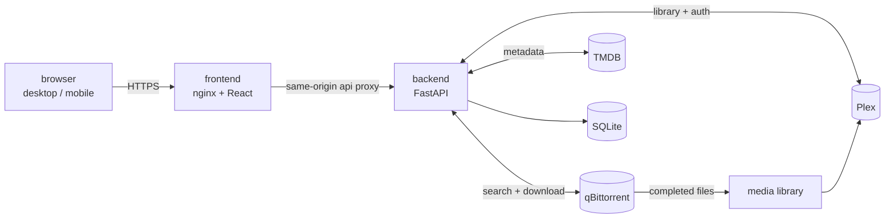

<div align="center">


# Obsidian

**Automated Media Downloading Made Simple**

Tap a poster. The right file lands in Plex. Nobody sees a torrent.

[](https://fastapi.tiangolo.com/)
[](https://react.dev/)
[](https://www.python.org/)
[](https://docs.docker.com/compose/)
[](https://www.plex.tv/)

</div>

---

## What it is

Obsidian is a self-hosted request-and-acquire front end for a Plex household. Someone
browses a Netflix-style catalogue — on their phone, or full width on a desktop — hits
**Request**, and the file shows up in Plex: correctly named, correctly foldered, at a
sensible quality.

Every torrenting decision happens in the backend and stays there. The people using it
never see a release name, a tracker, a seeder count, or a quality tier. That is the whole
design goal: **the household gets a streaming app; the admin gets an automation pipeline.**

> [!NOTE]
> This is a personal, single-household project built for one TrueNAS SCALE box. It is
> shared in the hope it is useful, but it is not a turnkey product — expect to read some
> configuration. See [Status and scope](#status-and-scope).

<!-- SCREENSHOT: hero shot of the Home page on desktop. Suggested path: docs/screenshots/home.png -->
<!-- Optional companion: the same page on a phone, docs/screenshots/home-mobile.png -->
<!--  -->

---

## Contents

- [Features](#features)
- [How it works](#how-it-works)
- [Requirements](#requirements)
- [Installation](#installation)
  - [Docker Compose](#option-a--docker-compose)
  - [TrueNAS SCALE](#option-b--truenas-scale-custom-app)
- [First-run setup](#first-run-setup)
- [Configuration](#configuration)
- [Remote access](#remote-access)
- [Updating](#updating)
- [Development](#development)
- [Project structure](#project-structure)
- [Status and scope](#status-and-scope)
- [Legal](#legal)
- [License](#license)

---

## Features

### For the household

| | |
|---|---|
| **Browse like a streaming app** | TMDB-backed home, movie and TV landing pages — trending, popular, by watch provider, by person. No torrent vocabulary anywhere in the UI. |
| **Requesting is one action** | Pick a title, hit Request. Quality, release group and tracker selection are made for you and never surfaced. |
| **Knows what you already have** | Titles already in Plex are badged on the grid, so nobody requests a film that's been sitting there for a year. |
| **Follow a show** | Subscribe to a series and new episodes are fetched as they air, on a schedule, per episode. |
| **Whole seasons at once** | "Get this whole season" / "Get the complete series" as an explicit, separate action from a standing subscription. |
| **Trailers** | Played inline on detail pages. |
| **Built for whatever's in your hand** | A real layout pass per tier rather than one design stretched: bottom tab bar and single-column on phones, wider spacing on tablets, top-bar navigation and full-width grids from 860px up. Hover affordances only where there's a pointer. |
| **Install it like an app** | A PWA with a proper manifest and icons — installable from the browser on desktop, or "Add to Home Screen" on mobile, where it runs standalone. |

### For whoever runs it

| | |
|---|---|
| **Plex account sign-in** | No separate passwords. People sign in with Plex, and access is granted by checking they can actually see your server. The owner becomes admin automatically. |
| **Per-person permissions** | Household panel with per-user request permissions and a full audit log of sign-ins and actions. |
| **Quality pipeline you control** | Resolution floor, source/codec/container preference tiers, seeder minimums and size bounds — all adjustable from Settings, not hardcoded. |
| **Automatic file organisation** | Completed downloads are hardlinked into a Plex-shaped library layout, with embedded cover art stripped from the video stream. |
| **Plex refresh on import** | The relevant library section is scanned — partially, when the path allows — as soon as a file lands. |
| **Storage and retention** | Disk usage visibility, request-history retention, and automatic source cleanup after import. |
| **Activity dashboard** | What's searching, downloading, stuck, or failed — with the reason. |
| **Self-update** | A "Check for updates" button runs a `git pull` and rebuilds the frontend. No Docker socket is ever mounted. |
| **Guided first run** | A setup wizard walks through the setup code, TMDB key, qBittorrent connection and Plex server link. |

<!-- SCREENSHOT: a 2x2 grid of feature shots — request flow, requests page, settings, activity dashboard. -->
<!-- Suggested paths: docs/screenshots/request.png, docs/screenshots/requests.png, docs/screenshots/settings.png, docs/screenshots/activity.png -->

---

## How it works



The request path, end to end:

1. **Search** — the backend drives qBittorrent's own search plugins asynchronously.
2. **Score** — candidates are filtered on structured API fields (`fileSize`, `nbSeeders`)
   wherever possible, and on whole-token filename parsing only where it has to be
   (resolution, source, codec, container, language). Never substring matching.
3. **Download** — the winner is handed to qBittorrent under a managed category.
4. **Organise** — on completion the file is hardlinked into the Plex library layout and
   the source is cleaned up after a delay.
5. **Refresh** — Plex scans the affected section, and the request is marked complete.

Requests are serialised through a single `asyncio.Lock` — no distributed queue, which is
correct at household scale. All job and request state lives in SQLite on a volume and
survives restarts.

**Three components, one deployable app.** Only the frontend publishes a port; the backend
is reachable only over the internal Compose network. The LAN restriction on setup routes,
the security headers and the rate limiting all live in `frontend/nginx.conf`, *in front of*
the backend — which is why the backend container must never publish a port directly.

---

## Requirements

| | |
|---|---|
| **Docker** | with Compose v2 |
| **qBittorrent** | v4.x or v5.x, WebUI enabled, with search plugins installed. Run separately — Obsidian does not deploy it. |
| **Plex Media Server** | reachable from the backend |
| **TMDB API key** | free, from [themoviedb.org](https://www.themoviedb.org/settings/api) |
| **Shared storage** | qBittorrent's download path and Obsidian's library paths must resolve to the same files (see [Path mapping](#path-mapping)) |

---

## Installation

### Option A — Docker Compose

```bash
git clone https://github.com/ThyGlizzyGlobber/Movie-Automation-Downloading-System.git obsidian
cd obsidian
```

Create `backend/.env`:

```ini
TMDB_API_KEY=your_tmdb_key_here

QBIT_HOST=192.168.1.10
QBIT_PORT=8080
QBIT_USERNAME=admin
QBIT_PASSWORD=your_qbit_password

MOVIE_LIBRARY_ROOT=/movie-library
TV_LIBRARY_ROOT=/tv-library
```

Mount your library paths into the backend container, then:

```bash
docker compose up -d --build
```

The app is served at **http://localhost:8080**. Continue to [First-run setup](#first-run-setup).

<!-- SCREENSHOT: terminal showing a successful `docker compose up -d --build`. Suggested path: docs/screenshots/install-compose.png -->

### Option B — TrueNAS SCALE (Custom App)

`truenas/custom-app-compose.yaml` is a ready-made Custom App config. It is **not** run with
`docker compose` — paste it into the TrueNAS Custom App form (or submit it as
`custom_compose_config_string` to `app.create`).

Before applying it:

1. `git clone` this repo onto the NAS — that clone is the deployed copy, and the only thing
   the self-updater ever touches.
2. Update the paths in the YAML to match where you cloned it.
3. Inline your real `TMDB_API_KEY` — TrueNAS Custom Apps have no `env_file` support.
4. *(Optional, for self-update)* Generate a read-only GitHub deploy key, store it outside
   the git-tracked tree with `0600` permissions, and point `GIT_SSH_KEY_PATH` at it.

<!-- SCREENSHOT: the TrueNAS Custom App form with the compose config pasted in. Suggested path: docs/screenshots/install-truenas.png -->

### Path mapping

qBittorrent and Obsidian are separate containers, so the path qBittorrent reports for a
finished download is not necessarily the path Obsidian can open. If they differ, set
`QBIT_MOVIE_SAVE_PATH` / `QBIT_TV_SAVE_PATH` to qBittorrent's view, and mount the same
storage into the backend at `MOVIE_LIBRARY_ROOT` / `TV_LIBRARY_ROOT`.

> [!IMPORTANT]
> Hardlinking only works **within one filesystem**. If downloads and library live on
> different volumes, files are copied instead — same result, more disk and more time.

---

## First-run setup

On first launch Obsidian serves a setup wizard instead of the app.

1. **Setup code** — printed in the backend log at startup. This proves you're the one
   setting the server up:
   ```bash
   docker compose logs backend | grep -i "setup code"
   ```
2. **TMDB key** — if it wasn't provided by environment variable.
3. **qBittorrent** — host, port and credentials, tested live before saving.
4. **Plex** — sign in with Plex and pick which server this install serves. Whoever
   completes this becomes the admin.

Setup routes are additionally restricted to LAN clients, so the bootstrap window cannot be
raced from the internet.

Afterwards, everyone else signs in with their own Plex account. Access is granted by
checking that the account can actually see your Plex server.

<!-- SCREENSHOT: the four setup wizard steps, in order. Suggested paths: docs/screenshots/setup-1-token.png … setup-4-plex.png -->

---

## Configuration

Most day-to-day tuning lives in **Settings** in the app. Environment variables are for
deployment-level wiring, and where both exist, **the environment wins**.

### Core

| Variable | Default | Purpose |
|---|---|---|
| `TMDB_API_KEY` | — | TMDB key. Can also be set in the wizard. |
| `QBIT_HOST` / `QBIT_PORT` | — | qBittorrent WebUI address. Also settable in the wizard. |
| `QBIT_USERNAME` / `QBIT_PASSWORD` | empty | qBittorrent WebUI credentials. |
| `MOVIE_LIBRARY_ROOT` | `/movie-library` | Where organised films are placed. |
| `TV_LIBRARY_ROOT` | `/tv-library` | Where organised episodes are placed. |
| `DB_PATH` | `backend/data/app.db` | SQLite database. Put this on a volume. |

### Path translation

| Variable | Default | Purpose |
|---|---|---|
| `QBIT_MOVIE_SAVE_PATH` | unset | qBittorrent's own view of the movie download path. |
| `QBIT_TV_SAVE_PATH` | unset | qBittorrent's own view of the TV download path. |

### Timing and limits

| Variable | Default | Purpose |
|---|---|---|
| `DOWNLOAD_POLL_INTERVAL_SECONDS` | `10` | How often active downloads are polled. |
| `SOURCE_CLEANUP_DELAY_SECONDS` | `60` | Grace period before a source file is removed post-import. |
| `RETENTION_CLEANUP_INTERVAL_SECONDS` | `3600` | How often request-history retention runs. |
| `EPISODE_RECHECK_POLL_INTERVAL_SECONDS` | `900` | How often episode auto-recheck runs. |
| `TRAILER_CACHE_MAX_FILES` | `20` | Cached trailer cap. |
| `FFPROBE_TIMEOUT_SECONDS` | `15` | Media inspection timeout. |

### Self-update

| Variable | Default | Purpose |
|---|---|---|
| `DEPLOY_REPO_PATH` | `/repo` | The deployed clone the updater pulls. |
| `GIT_SSH_KEY_PATH` | unset | Read-only deploy key for `git pull` over SSH. |
| `DEPLOY_TIMEOUT_SECONDS` | `60` | `git pull` timeout. |
| `DEPLOY_BUILD_TIMEOUT_SECONDS` | `180` | Frontend build timeout. |

---

## Remote access

Obsidian **never terminates HTTPS itself.** Exposing it to the internet requires a reverse
proxy in front of the frontend container. In rough order of "just works":

- **Cloudflare Tunnel** — no inbound port forward at all, and your home IP stays hidden.
  Point `cloudflared` at `http://frontend:80`; `truenas/custom-app-compose.yaml` carries the
  service, needing only a connector token from the Cloudflare dashboard.
- **Nginx Proxy Manager / Traefik** — if you already run one, add a host pointed at
  `http://frontend:80`.
- **The bundled Caddy profile** — automatic Let's Encrypt certificates, opt-in so it never
  starts on a plain `docker compose up`:
  ```bash
  PUBLIC_DOMAIN=your.domain.com docker compose --profile remote up -d
  ```
  Requires `PUBLIC_DOMAIN` to resolve to the host, with ports 80 and 443 forwarded.

> [!WARNING]
> Setup and Plex-linking are restricted to private IPs by `frontend/nginx.conf`, and a proxy
> reaches nginx from a private address of its own — so whatever you put in front of this must
> pass the real client address through, or that restriction matches the whole internet. The
> `set_real_ip_from`/`real_ip_header` pair at the top of that file's `server` block does this
> for a Cloudflare Tunnel; read the note there before exposing anything. Then check from
> outside the house that `/api/setup/status` answers **403**, not JSON.

> [!WARNING]
> Get it working over plain LAN HTTP first, confirm it on the real host, *then* set up the
> proxy. **Settings → Remote Access** is a note to yourself about where you published it,
> plus an audited record that you did — it does not affect sign-in either way.
>
> Session cookies decide `Secure` from the scheme of each request, so the LAN over HTTP and
> the tunnel over HTTPS both work at the same time. That needs the proxy to send
> `X-Forwarded-Proto`; `frontend/nginx.conf` does, and the map at the top of that file says
> what the header is and isn't worth trusting.

Whichever you choose, the same-origin `/api/` proxy inside `frontend/nginx.conf` is
untouched, so no CORS configuration is ever needed.

---

## Updating

From the app: **Settings → Updates → Check for updates.** That runs a `git pull` against the
deployed clone and rebuilds the frontend in place.

The endpoint runs exactly `git pull` — hardcoded. No path, branch or command is ever
accepted as input, and the Docker socket is never mounted. "Self-update" here means
"pull my own repo", nothing more privileged.

Rolling back is `git checkout` or `git revert` on the deployed copy.

---

## Development

```bash
# Backend
cd backend
python -m venv .venv
# Linux/macOS: source .venv/bin/activate    Windows: .venv\Scripts\activate
pip install -r requirements.txt
python -m pytest -q

# Frontend
cd frontend
npm install
npm run dev        # Vite dev server
npm run build      # tsc -b && vite build
npm run lint
```

The backend test suite is pure `pytest` with no external services — TMDB, qBittorrent and
Plex are all faked at the boundary.

---

## Project structure

```
backend/
  app/
    api.py              FastAPI routes; the only place auth is enforced
    worker.py           the background loop: watch, download, organise
    pipeline.py         search → score → download
    score.py            movie release scoring
    tv_score.py         episode scoring
    pack_score.py       whole-season / complete-series scoring
    resolve.py          movie resolution
    tv_resolve.py       show + episode resolution
    media_organizer.py  post-download file placement
    plex.py             Plex sign-in, library lookup, refresh
    tmdb.py             metadata and browse
    qbt.py              qBittorrent client
    db.py               SQLite store and migrations
    config.py           environment and defaults
  tests/                pytest suite
frontend/
  src/
    features/           one folder per area (home, movies, tv, settings, auth, setup)
    components/         shared UI
    api/                typed fetch wrappers
    styles/tokens.css   the design system, single source of truth
  nginx.conf            static serving, /api proxy, security headers, LAN gate
brand_identity/         brand kit and icons
design-exploration/     standalone HTML design references
truenas/                TrueNAS SCALE Custom App config
project.md              full design history and decision log
```

---

## Status and scope

Obsidian runs in production for one household on TrueNAS SCALE. It is actively developed
and the design history — every decision and why — is recorded in
[`project.md`](project.md).

Things worth knowing before you adopt it:

- It is **built around one deployment topology** (TrueNAS SCALE + an existing qBittorrent).
  Other setups should work, but they are not what it is tested against.
- Search quality depends entirely on **your** qBittorrent search plugins. Obsidian scores
  what they return; it cannot find what they don't.
- There is **no multi-tenancy**. One household, one Plex server, one shared settings panel.
- The brand mark is mid-replacement and currently still shows the old wordmark letter.

---

## Legal

Obsidian is automation software. It does not host, index, provide or bundle any content,
and it ships with no trackers, indexers or search plugins of its own — it drives a
qBittorrent instance that **you** install, configure and supply plugins for.

You are responsible for complying with the laws of your jurisdiction and with the terms of
any service you point it at. Use it for content you have the right to download.

---

## License

No license has been chosen yet, which means **all rights are reserved by default** and
others cannot legally reuse this code. If the intent is for people to use and contribute,
adding a license (MIT and AGPL-3.0 are the usual choices for self-hosted tools) should come
before promoting the repo.

---

<div align="center">

Built for the Smith household. Formerly Meridian, Smithflix, and The Family Downloader.

</div>
